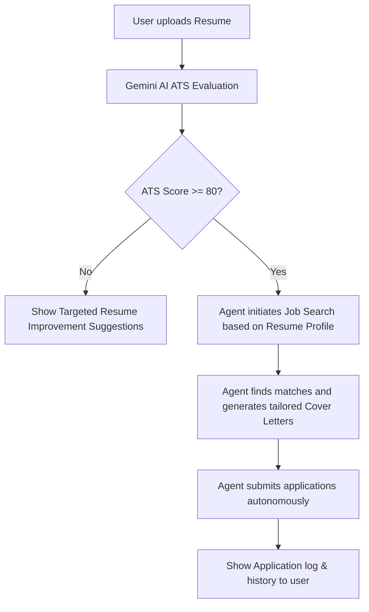

# Version 2.0 - Agentic AI Autonomous Job Application Flow

This document details the architectural plan, technical specifications, and implementation steps for introducing the **Autonomous Job Application Flow** in AI ChatBot 2.0.

---

## 1. Feature Overview

The core goal is to enable an agentic flow that processes a user's resume, rates it, and takes autonomous actions (searching and applying to jobs) based on the score.



### Key Capabilities
1. **ATS Evaluator**: Parses resume documents (PDF/Text) and generates a structured ATS score & audit.
2. **Resume Optimizer Agent (ATS < 80)**: Returns lists of missing keywords, layout suggestions, and bullet-point enhancements.
3. **Job Search & Apply Agent (ATS >= 80)**: Extrapolates search queries, searches job listings, tailors cover letters using resume + job details, and simulates/records submissions.

---

## 2. Technical Architecture & Database Schemas

### Mongoose Schemas

We will create two new models in the backend: `Resume.js` and `JobApplication.js` to store records.

#### `backend/models/Resume.js`
```javascript
const mongoose = require('mongoose');

const ResumeSchema = new mongoose.Schema({
  userId: { type: mongoose.Schema.Types.ObjectId, ref: 'User', required: false },
  fileName: { type: String, required: true },
  atsScore: { type: Number, required: true },
  jobSearchQuery: { type: String },
  skills: [String],
  missingKeywords: [String],
  contentSuggestions: [String],
  formattingSuggestions: [String],
  createdAt: { type: Date, default: Date.now }
});

module.exports = mongoose.model('Resume', ResumeSchema);
```

#### `backend/models/JobApplication.js`
```javascript
const mongoose = require('mongoose');

const JobApplicationSchema = new mongoose.Schema({
  userId: { type: mongoose.Schema.Types.ObjectId, ref: 'User', required: false },
  resumeId: { type: mongoose.Schema.Types.ObjectId, ref: 'Resume', required: true },
  jobTitle: { type: String, required: true },
  company: { type: String, required: true },
  location: { type: String },
  salary: { type: String },
  jobUrl: { type: String },
  coverLetter: { type: String },
  status: { type: String, enum: ['applied', 'failed'], default: 'applied' },
  appliedAt: { type: Date, default: Date.now }
});

module.exports = mongoose.model('JobApplication', JobApplicationSchema);
```

---

## 3. API Endpoints

### 1. Evaluate Resume
* **Endpoint**: `POST /api/resume/evaluate`
* **Request**: Multipart/Form-data containing `file` (PDF/Text)
* **Logic**:
  1. Parse document content using Gemini's multi-modal capabilities.
  2. Prompt Gemini to output a structured JSON response evaluating the resume.
  3. Save the evaluation details to Mongoose `Resume` collection.
  4. Return evaluation data.

### 2. Trigger Auto-Apply
* **Endpoint**: `POST /api/resume/auto-apply`
* **Request**: JSON body with `{ resumeId }`
* **Logic**:
  1. Retrieve resume details.
  2. Search for matching jobs using a job portal API (e.g., Adzuna, Reed, or a simulated job board search engine returning real matches).
  3. Loop through results. For each matching position:
     - Generate a personalized Cover Letter via Gemini.
     - Save a `JobApplication` entry.
  4. Return details of all successfully submitted applications.

### 3. Fetch History
* **Endpoint**: `GET /api/resume/history`
* **Logic**: Returns user's resume analysis results and historical job applications.

---

## 4. UI/UX Design

### 1. Attachment Menu Integration
- Add a new option in the plus menu popover: `💼 ATS Auto-Apply`.

### 2. Agent Dashboard Overlay/Panel
- Opens a dedicated, premium dashboard when clicked.
- Drag-and-drop file upload zone for resumes (`.pdf`, `.txt`, `.docx`).

### 3. Visual States
- **Evaluating State**: A futuristic circular radar scanner animation ("AI Agent reading resume structures...").
- **Low Score View (<80)**:
  - Gauge chart indicating ATS score in Orange/Red.
  - Tabs/Cards detailing improvement categories.
- **High Score View (>=80)**:
  - Gauge chart indicating ATS score in Green.
  - Real-time scrollable Terminal showing agent logs (`[Agent] Searching...`, `[Agent] Found 3 jobs...`, `[Agent] Tailoring cover letter for tech/finance...`).
  - Interactive table showing applied jobs, with buttons to click and read the AI-generated cover letter for each job.

---

## 5. Development Steps

### Phase 1: Backend Setup
1. Create Mongoose models.
2. Register endpoints in `server.js`.
3. Build Gemini ATS Evaluation prompts.
4. Implement Job Search mock/integration client.

### Phase 2: Frontend Setup
1. Design the dashboard UI container & custom styling.
2. Integrate drag-and-drop and attachment triggers.
3. Build the circular progress gauge and the real-time activity terminal.
4. Hook up API calls and verify application data rendering.
